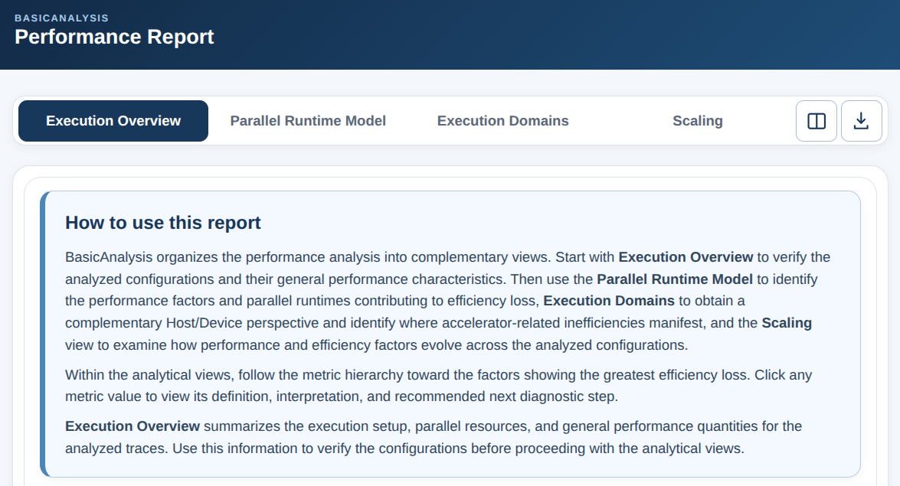
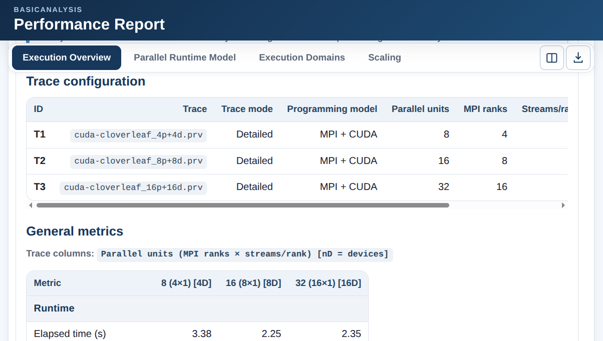
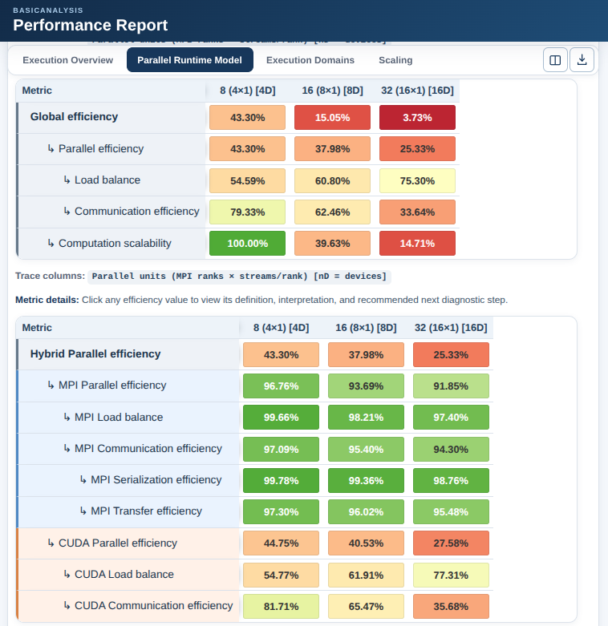
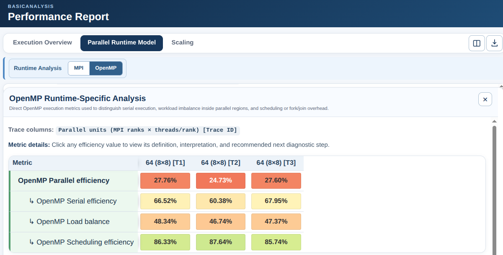
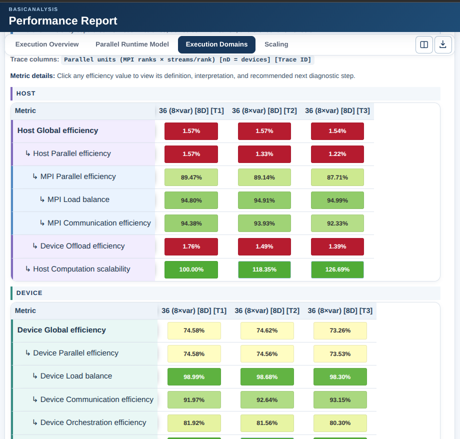
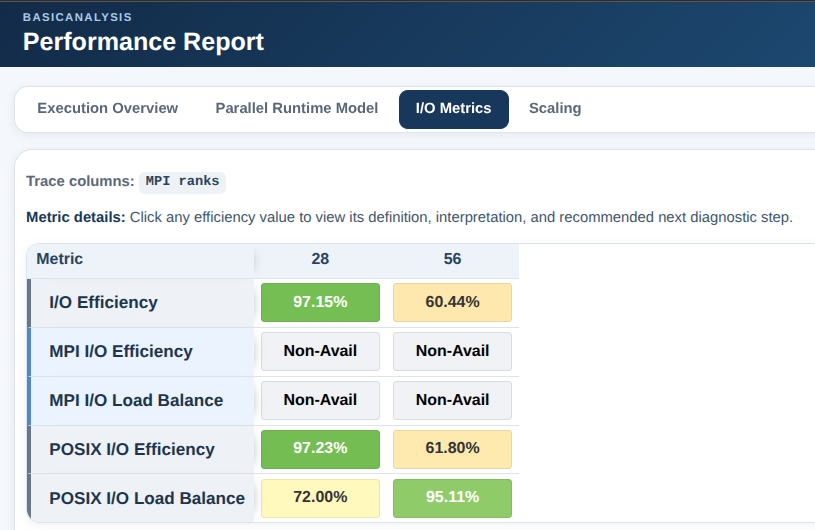
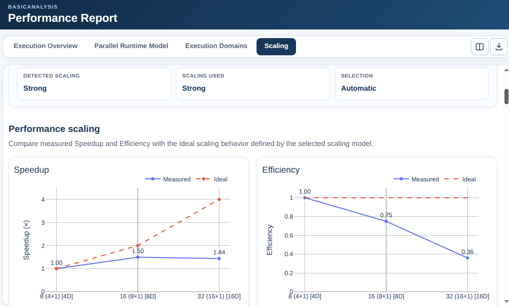
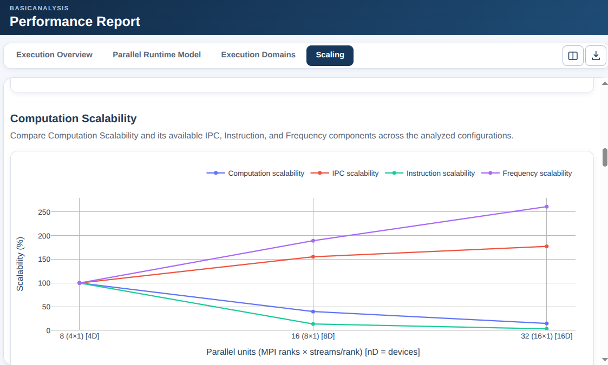
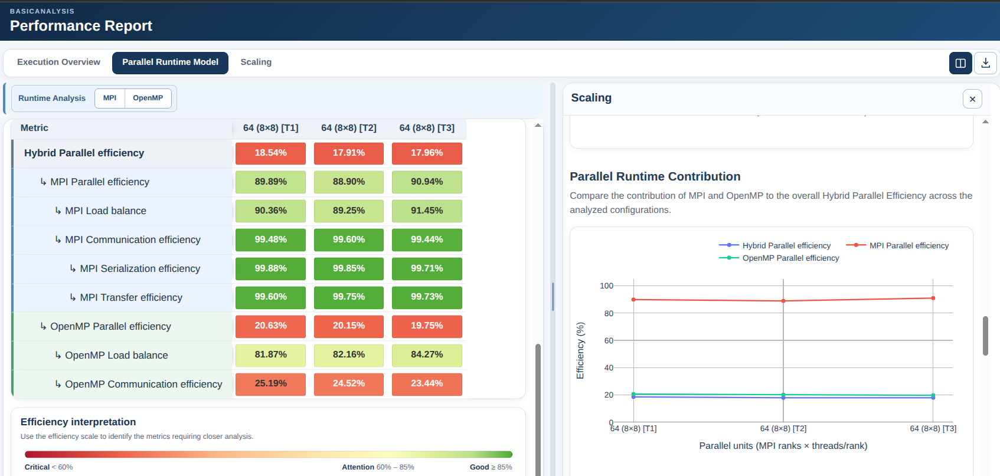
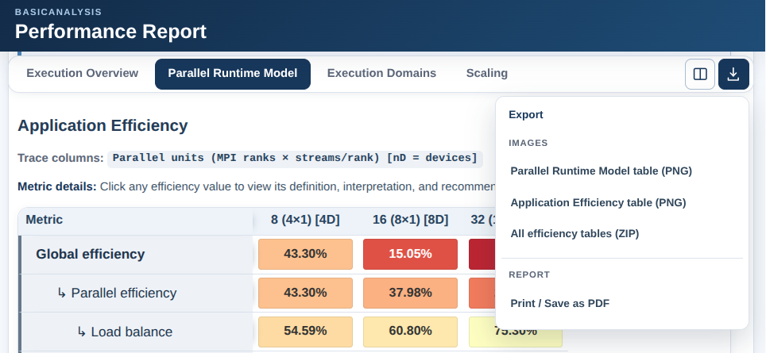

Performance Report
==================

BasicAnalysis generates an interactive performance report that organizes the
analysis into complementary views. Each view addresses a different question
about the application's performance and helps progressively narrow down the
factors responsible for efficiency loss.

The report is intended to support a hierarchical analysis workflow. Start with
the Execution Overview to verify the analyzed configurations, then use the
Parallel Runtime Model to identify the main sources of efficiency loss.
Runtime-Specific Analysis provides a more detailed view of the active parallel
runtimes, while Execution Domains identifies where accelerator-related
inefficiencies manifest. I/O Analysis provides a complementary view of the
weight and distribution of File I/O activity. Finally, the Scaling view shows
how performance and efficiency factors evolve across the analyzed
configurations.

These views are complementary and may use different analytical scopes. Not all
metrics shown in the report belong to the same multiplicative efficiency model.

The following sections describe the purpose of each report view and how to use
them during a performance analysis.

Report Interface
----------------

The BasicAnalysis performance report is organized around five primary analysis
views:

* **Execution Overview**
* **Parallel Runtime Model**
* **Execution Domains**
* **I/O Analysis**
* **Scaling**

Use the navigation bar shown in
:numref:`fig-report-report-main-navigation` to move between the different
report views.

.. _fig-report-report-main-navigation:

   Performance report navigation.

The report is designed as a guided analysis workspace. The primary views
provide complementary perspectives on the same execution rather than
independent analyses.

Runtime-specific analysis is accessed from the Parallel Runtime Model through
the **Runtime Analysis** selector rather than as a separate primary view.

The controls on the right side of the navigation bar provide access to the
complementary split view and to the report export functions. These features
are described later in this chapter.

Execution Overview
------------------

The **Execution Overview**, shown in
:numref:`fig-report-execution-overview`, is the starting point of the analysis.
It summarizes the execution configuration and general performance
characteristics of the analyzed traces.

.. _fig-report-execution-overview:

   Execution Overview.

Before interpreting efficiency metrics, verify that the reported trace
configuration corresponds to the intended experiment. In particular, check the
programming model, parallel resources, and accelerator configuration when
applicable.

The General Metrics table provides the main execution quantities used to
compare the analyzed configurations, including elapsed time, Speedup,
Efficiency, IPC, and processor frequency when available.

When several execution configurations are analyzed, these values provide an
initial indication of whether application performance improves as resources
increase. The detailed efficiency and scaling views should then be used to
identify which factors explain the observed behavior.

Parallel Runtime Model
----------------------

The **Parallel Runtime Model**, shown in
:numref:`fig-report-parallel-runtime-model`, identifies the performance factors
and parallel runtimes contributing to efficiency loss.

.. _fig-report-parallel-runtime-model:

   Parallel Runtime Model view.

Start with **Global Efficiency** and follow its child metrics toward the
lowest-efficiency factors. Global Efficiency separates losses associated with
Parallel Efficiency from changes in Computation Scalability.

For hybrid applications, the Parallel Runtime Model additionally decomposes
Parallel Efficiency across the active parallel runtimes.

The model can therefore be read in two complementary ways:

* **by performance factor**, following Global Efficiency toward Parallel
  Efficiency, Load Balance, Communication Efficiency, and Computation
  Scalability; or
* **by runtime**, comparing the contributions of MPI and the inner parallel
  runtime.

The performance-factor hierarchy identifies what type of efficiency loss is
present, while the runtime decomposition helps determine which parallel
runtime contributes to the observed loss.

In the interactive report, metric values are selectable. Clicking a metric
value opens its definition, interpretation, and recommended next diagnostic
step.

Runtime-Specific Analysis
-------------------------

When a runtime requires closer investigation, select it from the
**Runtime Analysis** selector. A split view opens, displaying the metrics
specific to the selected runtime while keeping the Parallel Runtime Model
visible for context. An example for the OpenMP parallel runtime is shown in
:numref:`fig-report-runtime-analysis`.

.. _fig-report-runtime-analysis:

   Runtime-specific analysis.

The selected runtime opens in the detailed-analysis panel while the Parallel
Runtime Model remains visible for context.

The available runtime-specific metrics depend on the programming model. For
example:

* MPI analysis examines MPI Load Balance and Communication Efficiency,
  including Serialization and Transfer Efficiency when available.
* OpenMP analysis provides the isolated OpenMP Serial, Load Balance, and
  Scheduling efficiencies.
* CUDA or HIP analysis displays the corresponding accelerator-runtime
  contribution defined by the selected hybrid model.

Runtime-Specific Analysis is intended to explain the runtime contribution
identified in the Parallel Runtime Model. Its metrics may therefore use a
different analytical scope from the application-level metrics.

Execution Domains
-----------------

For accelerator applications, the **Execution Domains** view provides a
complementary analysis of where performance inefficiencies manifest by
separating the execution into **Host** and **Device** domains.

.. _fig-report-execution-domains:

   Host and Device execution-domain analysis.

:numref:`fig-report-execution-domains` shows an example of the Host and Device
execution-domain analysis.

The Host domain characterizes CPU-side execution, including Host Parallel
Efficiency, accelerator offload behavior, and Host Computation Scalability.

The Device domain characterizes accelerator execution through Device Parallel
Efficiency and its Load Balance, Communication, and Orchestration components,
together with Device Computation Scalability.

For Device metrics, GPU stream activity is first mapped and flattened to the
corresponding physical devices. Consequently, the Device analysis represents
physical accelerator activity rather than treating individual GPU streams as
independent parallel execution units.

Host and Device are complementary execution domains and are **not** components
of a common multiplicative efficiency model. Therefore, Host Global Efficiency
and Device Global Efficiency must be interpreted independently and must not be
multiplied to obtain the application Global Efficiency.

Use the Parallel Runtime Model to determine **which runtime contributes to the
efficiency loss**, and the Execution Domains view to determine **where
accelerator-related inefficiencies manifest**.

A low execution-domain metric identifies where a performance loss becomes
visible. Detailed runtime or trace analysis may still be required to determine
the underlying cause.

I/O Analysis
------------

The **I/O Analysis** view provides a complementary characterization of the
File I/O activity captured in the analyzed traces.

BasicAnalysis distinguishes between **MPI-I/O** and **POSIX/ANSI C File I/O**
activity and reports the corresponding metrics when that activity is detected.

.. _fig-report-io-analysis:

   I/O Analysis.

The **I/O Analysis** view is shown in
:numref:`fig-report-io-analysis`. This includes:

* **I/O Efficiency**, which characterizes the overall weight of File I/O
  activity relative to useful computation;
* **MPI I/O Efficiency**, which characterizes the fraction of aggregate
  execution capacity not spent in MPI-I/O activity;
* **MPI I/O Load Balance**, which characterizes how evenly MPI-I/O duration is
  distributed across the execution units represented in the measurement;
* **POSIX I/O Efficiency**, which characterizes the fraction of aggregate
  execution capacity not spent in POSIX or ANSI C File I/O activity; and
* **POSIX I/O Load Balance**, which characterizes how evenly that File I/O
  activity is distributed across the execution units represented in the
  measurement.

I/O Efficiency and the API-specific I/O efficiencies answer questions about
the **weight of I/O activity**, whereas the Load Balance metrics characterize
its **distribution**. These two aspects should be interpreted together.

For example, a high I/O Load Balance does not necessarily indicate that I/O
overhead is small. All execution units may spend a similarly large amount of
time performing File I/O. Conversely, File I/O may have a small overall weight
while still being unevenly distributed.

When no activity for a particular File I/O interface is detected,
BasicAnalysis reports the corresponding API-specific Efficiency and Load
Balance metrics as ``Non-Avail``.

The I/O metrics are complementary diagnostic metrics. They are reported
independently from the hierarchical performance-efficiency model and must not
be interpreted as additional multiplicative components of Global Efficiency,
Parallel Efficiency, or Computation Scalability.

Use the I/O Analysis view when File I/O represents a relevant fraction of the
execution or when the distribution of I/O activity requires further
investigation. Detailed trace analysis or specialized I/O tools may be required
to determine the underlying cause of an observed I/O limitation.

Scaling
-------

The **Scaling** view analyzes how performance and efficiency factors evolve
across the analyzed execution configurations.

:numref:`fig-report-scaling-performance` shows the first part of the Scaling
view, which reports the detected and selected scaling model and compares the
measured Speedup and Efficiency with their ideal behavior.

.. _fig-report-scaling-performance:

   Scaling model and performance trends.

The remaining plots show how the efficiency hierarchy and complementary
runtime/domain metrics evolve across configurations.
:numref:`fig-report-scaling-metrics` shows an example of one of these metric
trends.

.. _fig-report-scaling-metrics:

   Efficiency-factor scaling trends.

Depending on the programming model and the available performance data, these
can include:

* Global Efficiency, Parallel Efficiency, and Computation Scalability.
* Load Balance and Communication Efficiency.
* Computation Scalability and its available IPC, Instruction, and Frequency
  components.
* Runtime-specific Parallel Efficiency contributions.
* MPI Load Balance, Communication, Serialization, and Transfer Efficiency.
* Host execution-domain metrics.
* Device execution-domain metrics.
* I/O-related metrics when available.

Computation Scalability and its associated factors are evaluated relative to a
reference execution. A value of 100% indicates behavior equivalent to the
reference under the selected scaling model, values below 100% indicate
degradation, and values above 100% indicate improvement.

Other efficiency metrics shown in the Scaling view retain their own metric
definitions. Their trends should be interpreted by examining how the metric
value changes across configurations rather than assuming that every plotted
metric is normalized to the reference execution.

Use the trends to identify which factors degrade as the application scales. A
degrading metric identifies where the scalability loss becomes visible, but it
does not by itself establish the root cause. Further trace analysis may be
required to explain the observed behavior.

Comparing Complementary Views
-----------------------------

:numref:`fig-report-split-view` shows the split-view option, which allows two
analysis views to be displayed simultaneously.

.. _fig-report-split-view:

   Complementary split-view analysis.

This is useful when evidence from two analytical perspectives should be
compared directly, for example:

* Parallel Runtime Model with Scaling;
* Parallel Runtime Model with Execution Domains;
* Parallel Runtime Model with I/O Analysis;
* Execution Domains with Scaling; or
* Execution Overview with a detailed analytical view.

The two views remain analytically independent. The split layout is intended to
facilitate comparison, not to imply that the metrics shown in both panels
belong to the same multiplicative model.

Exporting Report Content
------------------------

The export control provides several ways to save analysis results.

.. _fig-report-export-menu:

   Report export menu.

Depending on the active analysis, efficiency tables can be exported as PNG
images. Multiple tables can also be exported together, and all available
efficiency tables can be saved in a ZIP archive.

:numref:`fig-report-export-menu` shows the export menu for saving an efficiency
table from the Parallel Runtime Model view as a PNG image.

The complete report can be exported using **Print / Save as PDF**. This
generates the printable report from the current analysis data and opens the
browser print dialog, where the report can be saved as PDF.

PDF generation is therefore initiated explicitly from the interactive report;
BasicAnalysis does not automatically generate a PDF during normal execution.

Following the Analysis Workflow
-------------------------------

The report views are designed to be used together rather than as independent
analyses. A typical analysis follows this progression:

#. **Verify the executions** in the Execution Overview.
#. **Identify the dominant efficiency loss** using Global Efficiency and its
   hierarchy.
#. **Determine the responsible parallel runtime** using the Parallel Runtime
   Model.
#. **Explain the runtime contribution** using Runtime-Specific Analysis.
#. For accelerator applications, **identify where the inefficiency manifests**
   using the Host and Device execution domains.
#. When File I/O activity is relevant, **evaluate its weight and distribution**
   using I/O Analysis.
#. **Examine how the relevant factors evolve** across configurations in the
   Scaling view.
#. Use detailed trace analysis or specialized performance tools when additional
   evidence is required to determine the underlying cause.

This workflow is not strictly linear. The different views provide
complementary evidence and may use different analytical scopes.

The Execution Overview establishes the context of the experiment. The
hierarchical performance model identifies whether a significant performance
loss exists and which broad factor dominates. The Parallel Runtime Model and
Runtime-Specific Analysis attribute and explain parallel-runtime losses.
Execution Domains localize accelerator-related inefficiencies to the Host or
Device side. I/O Analysis independently characterizes the contribution and
distribution of File I/O activity. Finally, the Scaling view shows how these
relevant performance characteristics evolve as the execution configuration
changes.

Together, these views progressively narrow the analysis from identifying a
performance problem to determining which factors, runtimes, execution domains,
or complementary activities should be investigated in greater detail.